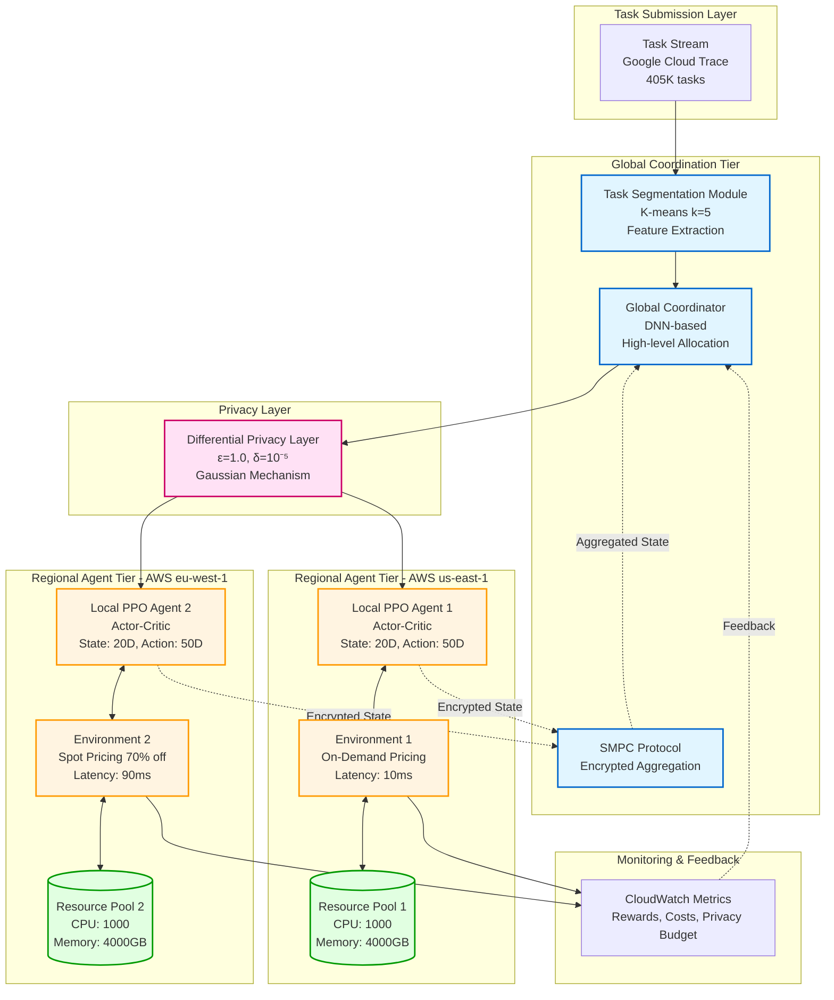
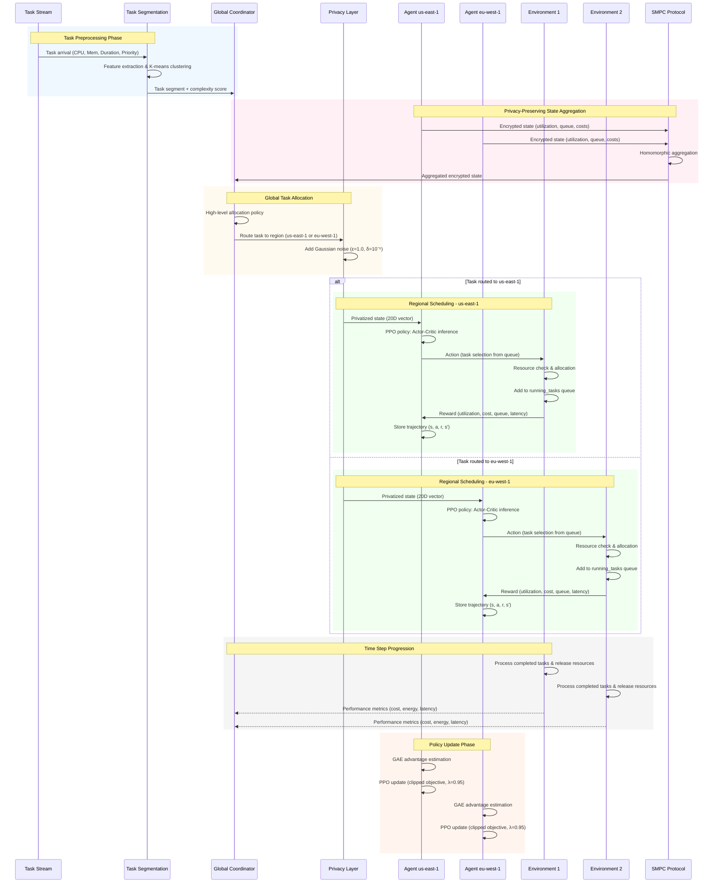

# 4. DESIGN SPECIFICATIONS

## 4.1 System Architecture Overview

The proposed privacy-preserving hierarchical deep reinforcement learning framework employs a two-tier architecture optimizing task scheduling across distributed cloud regions while maintaining differential privacy guarantees. The architecture comprises a Global Coordinator at the upper tier and Local Agents deployed across AWS regions (us-east-1 and eu-west-1) at the lower tier.

The hierarchical design addresses three fundamental challenges: (i) minimizing cross-region communication overhead through localized decision-making, (ii) enabling privacy-preserving state aggregation via secure multi-party computation, and (iii) balancing global optimization with regional constraints. The Global Coordinator makes high-level task allocation decisions determining regional routing, while Local PPO agents independently manage fine-grained scheduling within their regions, optimizing cost, latency, energy, and utilization.

The framework integrates four specialized modules: a Task Segmentation Module clustering tasks using K-means, a Differential Privacy Layer implementing ε-differential privacy through Gaussian noise, Local PPO Agents with Actor-Critic architectures, and a Multi-Cloud Environment Simulator modeling resource dynamics. Figure 1 illustrates the complete system architecture showing hierarchical organization and inter-component communication flows.

**Figure 1.** Hierarchical system architecture showing the two-tier design with Global Coordinator, regional PPO agents deployed across AWS us-east-1 and eu-west-1, task segmentation module, differential privacy layer, and cross-region communication via SMPC protocol.

## 4.2 Component Design

### 4.2.1 Global Coordinator Module

The Global Coordinator employs a deep neural network for high-level task allocation across distributed regions. It receives privacy-preserved state aggregations from regional agents through secure multi-party computation and outputs distribution decisions specifying regional assignments. The network processes aggregated state vectors encoding regional resource availability, queue lengths, utilization levels, and performance metrics. The coordinator policy is trained using policy gradients to maximize a global objective balancing cost minimization, latency reduction, and load distribution equity. By operating at higher abstraction than local agents, it addresses strategic allocation while delegating tactical scheduling to regional agents, reducing communication frequency and enabling privacy-preserving operations through encrypted state sharing.

### 4.2.2 Local PPO Agents

Each regional deployment hosts an independent PPO agent implementing an Actor-Critic architecture. The network accepts 20-dimensional state vectors encoding resource availability, task queue characteristics, running task counts, provider profiles, and episode progress. Two shared hidden layers with 256 and 128 neurons respectively employ ReLU activations and 20% dropout. The architecture bifurcates into an actor head producing 50-dimensional action logits for discrete task selection and a critic head outputting scalar value estimates.

The PPO algorithm employs Generalized Advantage Estimation with λ=0.95, clipped surrogate objective with ε=0.2, and Adam optimizer with learning rate 3×10⁻⁴. The agent optimizes a multi-objective reward function: utilization efficiency (30%), queue management (20%), waiting time penalties (15%), cost efficiency (15%), energy consumption (10%), and completion bonuses (10%). Training proceeds through episodic rollouts processing up to 200 decisions over randomized workloads, with policy updates via mini-batch gradient descent.

### 4.2.3 Task Segmentation Module

The Task Segmentation Module performs unsupervised clustering into five complexity-based segments using K-means. Feature extraction processes six attributes: CPU request, memory request, data size, priority, duration, and resource intensity. StandardScaler performs z-score normalization ensuring equal weighting. The fitted model assigns tasks to nearest cluster centroids, enabling complexity-aware routing. A scalar complexity score computed as the product of CPU, memory, and duration normalized by a constant facilitates threshold-based splitting. Task segmentation reduces state space complexity and enables regional agent specialization toward specific task profiles.

### 4.2.4 Differential Privacy Layer

The Differential Privacy Layer implements ε-differential privacy through calibrated Gaussian noise addition to state vectors before action selection. The noise scale σ is computed as σ = √(2ln(1.25/δ)) × Δf / ε, where ε=1.0, δ=10⁻⁵, and Δf quantifies state representation sensitivity. During training, the layer intercepts state vectors, adds independent Gaussian noise N(0, σ²I) with sensitivity-scaled variance, and forwards privatized states to the agent. This ensures policy gradients incorporate privacy noise rather than applying it post-processing. Privacy budget accumulates across episodes according to composition theorems, with total cost tracked for compliance. The Gaussian mechanism provides bounded differential privacy under assumptions of bounded state components.

### 4.2.5 Multi-Cloud Environment Simulator

The environment simulator models distributed resource dynamics and multi-objective optimization. The 20-dimensional state vector comprises normalized CPU/memory availability, utilization percentages, queue lengths, running task counts, average queued task requirements, provider cost/energy coefficients, network latency, episode progress, completion/failure rates, and cumulative costs. The action space defines 50 discrete actions for task selection from regional queues, enabling learned prioritization.

The reward function implements weighted multi-objective optimization: utilization rewards encouraging 60-80% usage, queue management rewards, waiting time penalties beyond thresholds, cost efficiency normalizing expenses by computational requirements, energy penalties, and completion bonuses. The simulator maintains queues for pending, running, completed, and failed tasks. Time progression triggers resource release for completed tasks based on simulated durations, resource allocation for scheduled tasks, and state updates, creating non-stationary dynamics requiring adaptive policies.

## 4.3 Data Flow and Communication Protocol

The workflow begins with task arrival from Google Cloud Trace, carrying CPU/memory requirements, duration, priority, data size, and timestamp. The Task Segmentation Module performs feature extraction, clustering assignment, and complexity scoring. The Global Coordinator determines target regions based on segment classification and global state. Regional states undergo privacy preservation through Gaussian noise addition before encrypted aggregation via secure multi-party computation, enabling the coordinator to compute aggregate statistics without accessing plaintext states. Homomorphic encryption properties enable summation and averaging on ciphertexts.

Local agents receive assignments and privatized states, executing PPO policies to select tasks from regional queues. Selected tasks undergo resource feasibility checking, followed by allocation and addition to running task queues with completion timestamps. Task completion triggers resource release, state updates, and reward signal generation. Rewards and state transitions form trajectory data for PPO updates through advantage estimation and clipped objective optimization.

Cross-region communication between us-east-1 and eu-west-1 occurs asynchronously with state synchronization at episode boundaries, reducing network overhead. The measured 80-120ms cross-region latency influences allocation decisions, with the coordinator learning to account for delays when routing time-sensitive tasks. Figure 2 illustrates the complete operational sequence.

**Figure 2.** Sequence diagram illustrating the complete operational workflow including task preprocessing, privacy-preserving state aggregation via SMPC, global allocation decisions, regional PPO-based scheduling with differential privacy, resource management, and policy updates. The diagram shows parallel execution paths for both AWS regions (us-east-1 and eu-west-1).

## 4.4 Deployment Architecture

The deployment leverages multi-region AWS infrastructure spanning us-east-1 (Northern Virginia) and eu-west-1 (Ireland) to achieve realistic heterogeneity in latency, cost, and reliability. Account 1 hosts the Global Coordinator on a t3.xlarge EC2 instance (4 vCPUs, 16GB RAM) using On-Demand pricing at $0.1664/hour, alongside Local Agent 1 on t3.medium. Account 2 deploys Local Agent 2 on t3.large Spot instances at $0.0166/hour, representing 90% cost reduction with availability variability.

Cross-region networking employs VPC peering with security groups configured for HTTPS and SMPC protocol communication. Measured cross-region latency ranges 80-120ms, introducing realistic delays influencing allocation decisions. Storage comprises regional S3 buckets for model artifacts and results, with DynamoDB tables providing low-latency state persistence. CloudWatch monitors custom metrics including episode rewards, costs, privacy budget consumption, utilization percentages, and completion rates.

This configuration creates genuine heterogeneity through pricing differences (On-Demand vs Spot with 10× cost variance), geographic separation inducing latency disparities, and reliability tradeoffs from interruptible Spot instances, enabling validation of the framework's multi-region optimization capabilities under realistic constraints while maintaining privacy guarantees.
